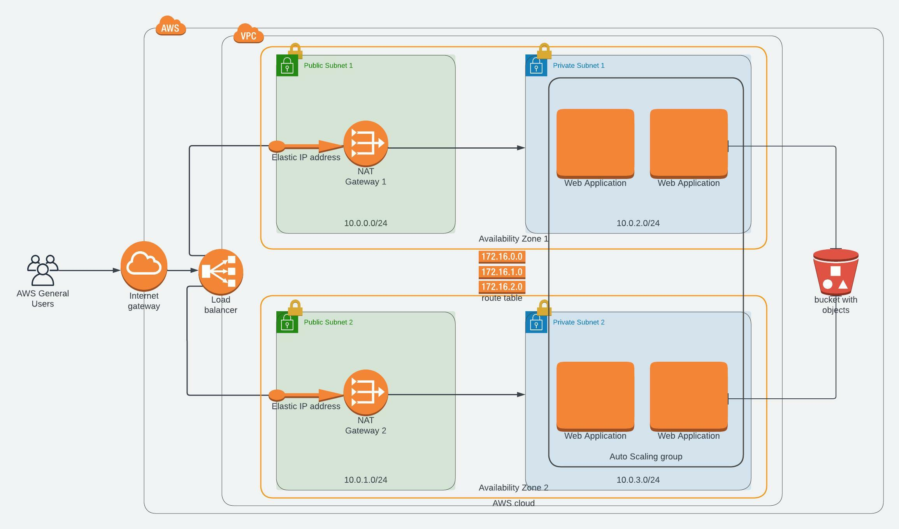

# Project II  
---
## Deploy a high-availability web app using CloudFormation  
---
### Project description

This project will help deploy web servers for a highly available web app using CloudFormation. The cloudFormation  
template provided creates and deploys infrastructure for a dummy application from the ground up.  
It begins by deploying the network components, followed by servers, security roles and software.  
### Infrastructure design.  
---
  
---
## How to run the template.  
---
1. When deploying the infrastructure for the first time you'll use the executable bash file [**`create`** ](/create) where you'll need to include the following arguments `stack-name` `template-file` and the `parameter-file`.  
**`./create stack-name template-file.yml parameter-file.json`**  
2. When making changes or updating your template you simply use the executable bash file [**`update`**](/update)instead.  
**`./update stack-name template-file.yml parameter-file.json`**  
---
### Confirm that it is working.  
This [Udagram](http://serve-elbud-1vx6z5bb64yix-985667153.us-east-1.elb.amazonaws.com/ "Udagram load balancer link") link will redirect you to the working dummy application.  

